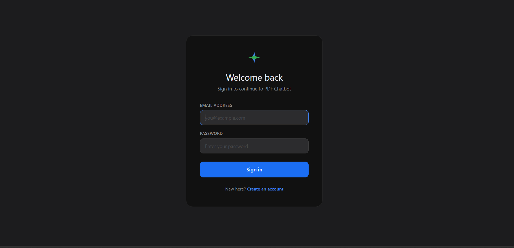
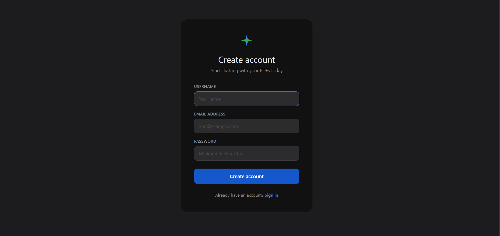
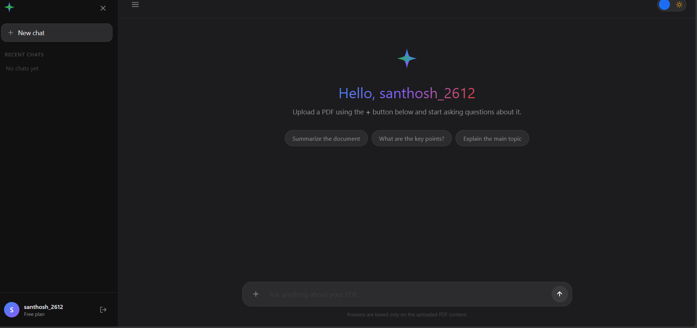
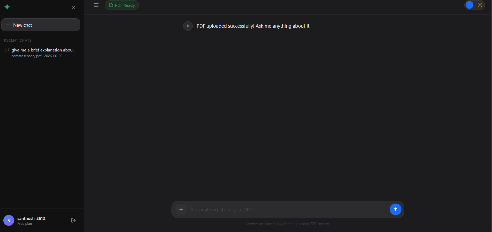
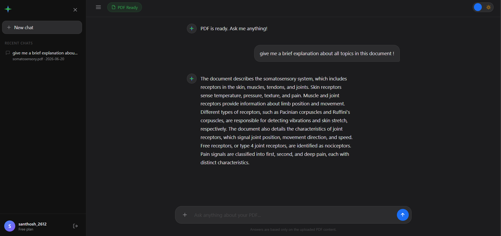

# 🤖 AI PDF Chatbot using RAG

## 📌 Overview

AI PDF Chatbot is a **Retrieval-Augmented Generation (RAG)** application built with **Flask, FAISS, SQLite, and Google's Gemini API**.

Users can upload PDF documents, ask questions about their content, and receive accurate, context-aware responses generated using a RAG pipeline.

The application extracts text from PDFs, converts text into embeddings, stores them in a FAISS vector database, retrieves the most relevant chunks based on the user's query, and uses Gemini to generate intelligent answers.

---

## 🚀 Features

* 🔐 User Authentication (Signup/Login)
* 📄 PDF Upload & Processing
* ✂️ Intelligent Text Chunking
* 🧠 Embedding Generation
* 🔎 FAISS Vector Similarity Search
* 🤖 Retrieval-Augmented Generation (RAG)
* 💬 Context-Aware Question Answering
* 🗂 Chat History Management
* 📱 Responsive User Interface

---

## 🏗 System Architecture

```text
PDF Upload
    ↓
Text Extraction
    ↓
Text Chunking
    ↓
Embedding Generation
    ↓
FAISS Vector Database
    ↓
Relevant Context Retrieval
    ↓
Gemini API
    ↓
Answer Generation
```

---

## 🛠 Tech Stack

| Technology | Purpose                        |
| ---------- | ------------------------------ |
| Python     | Backend Development            |
| Flask      | Web Framework                  |
| SQLite     | Database                       |
| FAISS      | Vector Search                  |
| Gemini API | LLM Response Generation        |
| HTML       | Frontend                       |
| CSS        | Styling                        |
| RAG        | Retrieval-Augmented Generation |

---

## 📂 Project Structure

```text
AI-PDF-Chatbot/
│
├── app.py
├── utils/
│   ├── pdf_reader.py
│   ├── chunker.py
│   ├── embeddings.py
│   ├── faiss_db.py
│   └── rag.py
│
├── templates/
│   ├── index.html
│   ├── login.html
│   └── signup.html
│
├── static/
│   ├── style.css
│   └── auth.css
│
├── uploads/
├── chatbot.db
├── requirements.txt
└── README.md
```

---

## ⚙️ Installation

### Clone Repository

```bash
git clone https://github.com/santhoshworkspace26/RAG-Powered-PDF-Chatbot.git

cd RAG-Powered-PDF-Chatbot
```

### Create Virtual Environment

```bash
python -m venv venv
```

### Activate Environment

**Windows**

```bash
venv\Scripts\activate
```

**Linux / Mac**

```bash
source venv/bin/activate
```

### Install Dependencies

```bash
pip install -r requirements.txt
```

---

## 🔑 Configure Gemini API

Create a `.env` file:

```env
GEMINI_API_KEY=YOUR_GEMINI_API_KEY
```

---

## ▶️ Run Application

```bash
python app.py
```

Open in your browser:

```text
http://127.0.0.1:5000
```

---

## 📸 Screenshots

### Login Page



### Signup Page



### Dashboard



### PDF Upload



### Chat Interface



---

## 🔍 How RAG Works

1. User uploads a PDF document.
2. Text is extracted from the PDF.
3. Text is divided into smaller chunks.
4. Embeddings are generated for each chunk.
5. Embeddings are stored in a FAISS vector database.
6. User submits a question.
7. Relevant chunks are retrieved using similarity search.
8. Retrieved context is sent to Gemini API.
9. Gemini generates a context-aware response.

---

## 🎯 Future Improvements

* Multi-PDF Support
* Conversation Memory
* PDF Summarization
* Voice-Based Queries
* Cloud Deployment
* User Profile Management

---

## 👨‍💻 Author

**Sandy**

Aspiring AI/ML & Full Stack Developer

---

## ⭐ Support

If you found this project useful, consider giving it a ⭐ on GitHub.
